# 🧬 GenShare: The Journey of Your Genomic Data

GenShare is a secure platform that gives you (the Patient) total control over your DNA data. This guide explains how your data moves safely from a lab to a researcher with your permission.

## 🗺️ The Big Picture

This map shows how your data travels through our secure "digital vault" and "smart ledger."

```mermaid
graph LR
    subgraph "Your Entry Point"
        P((👤 You))
        L((🧪 Lab))
        R((🔍 Researcher))
    end

    subgraph "GenShare Security Layer"
        Portal[GenShare Portal]
        Ledger{{📜 The Smart Ledger<br/>'Blockchain'}}
    end

    subgraph "The Storage Vault"
        Vault[(🔐 The Digital Vault<br/>'IPFS')]
        Catalog[(🗃️ The Index<br/>'Database')]
    end

    %% Flow logic
    L -- "1. Uploads DNA" --> Portal
    Portal -- "2. Seals Data" --> Vault
    Portal -- "3. Records Proof" --> Ledger
    Portal -- "4. Updates Index" --> Catalog

    R -- "5. Finds Data" --> Portal
    Portal -- "6. Asks You" --> P
    P -- "7. Grants Access" --> Portal
    Portal -- "8. Unlocks Data" --> R
    
    %% Styling
    style Ledger fill:#f96,stroke:#333,stroke-width:2px
    style Vault fill:#6cf,stroke:#333,stroke-width:2px
    style P fill:#bbf,stroke:#333,stroke-width:4px
```

---

## 🚶 Step-by-Step Breakdown

### 💎 Step 1: Secure Deposit
When a **Genomic Lab** uploads your DNA data:
- **Metaphor**: Imagine the lab putting your data in a high-security safe.
- **What happens**: The data is encrypted (scrambled) and hidden in **The Digital Vault (IPFS)**. A "Receipt" is carved into **The Smart Ledger (Blockchain)** so no one can ever tamper with it.

### 🔍 Step 2: The Researcher Finds a Match
A **Researcher** looking to solve a medical mystery searches our **Index (Database)**.
- They can see "Patient A has a Type-B record," but they **cannot see your name or your data**.
- They must send an **Access Request** to you through the portal.

### 🔑 Step 3: Your Decision (The Key)
You receive a notification in your **Dashboard**. 
- You can see exactly *who* wants your data and *why*.
- If you click **Approve**, the **Smart Ledger** is updated with a "Digital Key" for that specific researcher.
- **You are the only person who can turn this key.**

### 📥 Step 4: Controlled Access
Only after you approve:
- The portal verifies the "Digital Key" on **The Smart Ledger**.
- If valid, it fetches the scrambled data from **The Digital Vault** and safely delivers it to the **Researcher**.
- You can **Revoke** this key at any time, immediately locking the vault again.

---

## Technology

| Component | What it is | Why we use it |
| :--- | :--- | :--- |
| **Blockchain** | The Smart Ledger | To ensure no one can change history or access data without proof of your consent. |
| **IPFS** | The Digital Vault | To store your large genomic files in a way that is decentralized and highly secure. |
| **MongoDB** | The Index | To help researchers find the right datasets quickly without compromising privacy. |

> [!TIP]
> **Privacy First**: We never store your name or physical address on the Smart Ledger. Everything is handled via your secure Digital Wallet.
