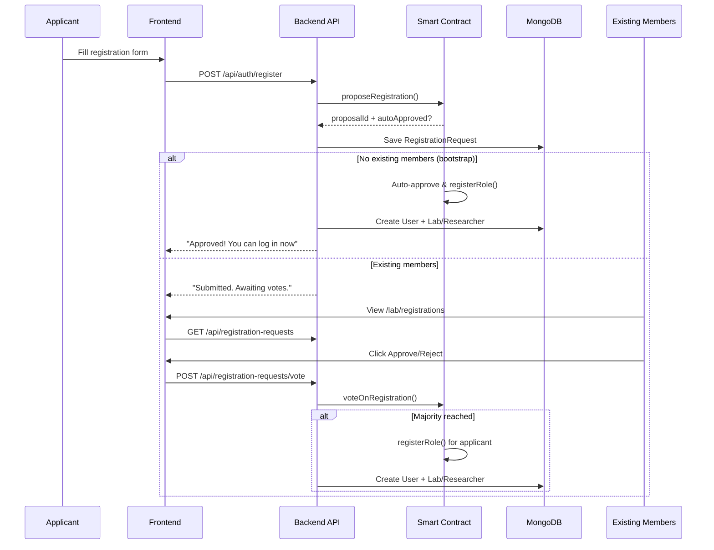

# GenShare — Blockchain-Based Genomic Data Sharing Platform
A decentralized platform for secure, auditable, and consent-driven exchange of genomic datasets between patients, laboratories, and researchers using blockchain smart contracts.

**Built with:** Next.js · MongoDB · Solidity (Hardhat) · Ethers.js · Tailwind CSS

---

## Table of Contents

1. [Prerequisites](#1-prerequisites)
2. [Clone & Install](#2-clone--install)
3. [Environment Setup](#3-environment-setup)
4. [Start MongoDB](#4-start-mongodb)
5. [Seed the Database](#5-seed-the-database)
6. [Start the Blockchain (Hardhat)](#6-start-the-blockchain-hardhat)
7. [Deploy the Smart Contract](#7-deploy-the-smart-contract)
8. [Start the Application](#8-start-the-application)
9. [IPFS Setup (File Storage)](#9-ipfs-setup-file-storage)
10. [Login Credentials](#10-login-credentials)
11. [Project Structure](#11-project-structure)
12. [Smart Contract Details](#12-smart-contract-details)
13. [API Endpoints](#13-api-endpoints)
14. [Troubleshooting](#14-troubleshooting)

---

## 1. Prerequisites

Ensure the following are installed on your system:

| Tool | Version | Download |
|------|---------|----------|
| **Node.js** | v18 or later | [nodejs.org](https://nodejs.org/) |
| **npm** | v9 or later | Included with Node.js |
| **MongoDB** | v6 or later | [mongodb.com](https://www.mongodb.com/try/download/community) |
| **IPFS (Kubo)** | v0.28+ | [dist.ipfs.tech](https://dist.ipfs.tech/#kubo) |
| **MetaMask** | Latest | [metamask.io](https://metamask.io/) (browser extension) |
| **Git** | Latest | [git-scm.com](https://git-scm.com/) |

---

## 2. Clone & Install

```bash
# Step 1: Clone the repository
git clone <repository-url>
cd genomic-data-platform

# Step 2: Install all dependencies
npm install
```

This installs both the Next.js frontend/backend dependencies and Hardhat blockchain tools.

---

## 3. Environment Setup

Create a `.env` file in the project root (or edit the existing one):

```env
# MongoDB connection string
DATABASE_URL="mongodb://localhost:27017/genomic-data-platform"

# Hardhat Local Blockchain
RPC_URL="http://127.0.0.1:8545"

# Hardhat account #0 private key (well-known dev key, NEVER use in production)
HARDHAT_PRIVATE_KEY="0xac0974bec39a17e36ba4a6b4d238ff944bacb478cbed5efcae784d7bf4f2ff80"

# Contract address — set after running deploy (Step 7)
NEXT_PUBLIC_CONTRACT_ADDRESS=""

# IPFS Configuration
IPFS_BINARY_PATH="E:\kubo_v0.28.0_windows-amd64\kubo\ipfs.exe"  # Path to your ipfs binary
IPFS_API_URL="http://127.0.0.1:5001"
IPFS_GATEWAY_URL="http://127.0.0.1:8080"
IPFS_ENCRYPTION_KEY="your-secret-encryption-key"  # AES-256 key for file encryption
```

> **⚠️ Important:** The `NEXT_PUBLIC_CONTRACT_ADDRESS` will be filled in after Step 7 (deploying the smart contract).

---

## 4. Start MongoDB

Make sure MongoDB is running locally on port `27017`.

**Windows (if installed as a service):**
```bash
# MongoDB should already be running. Verify with:
mongosh
```

**Windows (manual start):**
```bash
mongod --dbpath "C:\data\db"
```

**macOS/Linux:**
```bash
sudo systemctl start mongod
# or
mongod --dbpath /data/db
```

You should see a successful connection when running `mongosh`.

---

## 5. Seed the Database

This populates MongoDB with test data: users, labs, researchers, genomic records, access requests, consents, and audit events.

```bash
npm run seed
```

**Expected output:**
```
Connected to MongoDB
Cleared existing data
Dropped old User indexes
Created 3 lab organizations
Created 3 researcher profiles
Created 9 users
Created 3 genomic records
Created 4 access requests
Created 2 consents
Created 8 audit events

✅ Database seeded successfully!
```

---

## 6. Start the Blockchain (Hardhat)

Open a **new terminal** (keep it running throughout development):

```bash
npm run hardhat:node
```

**Expected output:**
```
Started HTTP and WebSocket JSON-RPC server at http://127.0.0.1:8545/

Accounts
========
Account #0: 0xf39Fd6e51aad88F6F4ce6aB8827279cffFb92266 (10000 ETH)
Account #1: 0x70997970C51812dc3A010C7d01b50e0d17dc79C8 (10000 ETH)
...
```

> **⚠️ Keep this terminal open!** The Hardhat node must be running for blockchain features to work. If you close it, all on-chain data is lost and you must re-deploy (Step 7).

---

## 7. Deploy the Smart Contract

Open a **second terminal** and run:

```bash
# Step 1: Compile the Solidity contract
npm run hardhat:compile

# Step 2: Deploy to the local Hardhat node
npm run hardhat:deploy
```

**Expected output:**
```
Deploying GenShareRegistry to local Hardhat node...

✅ GenShareRegistry deployed to: 0x2279B7A0a67DB372996a5FaB50D91eAA73d2eBe6

📋 Registering roles for test accounts...
  Owner/Server: 0xf39Fd6e51aad88F6F4ce6aB8827279cffFb92266
  Patient:      0x70997970C51812dc3A010C7d01b50e0d17dc79C8
  Lab:          0x3C44CdDdB6a900fa2b585dd299e03d12FA4293BC
  Researcher:   0x90F79bf6EB2c4f870365E785982E1f101E93b906

🚀 Deployment complete!
```

**Step 3: Copy the contract address to `.env`:**

```env
NEXT_PUBLIC_CONTRACT_ADDRESS="0x2279B7A0a67DB372996a5FaB50D91eAA73d2eBe6"
```

> **Note:** The address may differ each time you deploy. Always copy the address from the deploy output.

---

## 8. Start the Application

Open a **third terminal**:

```bash
npm run dev
```

The app will be available at: **http://localhost:3000**

---

## 9. IPFS Setup (File Storage)

GenShare uses **IPFS (InterPlanetary File System)** to store genomic files in a decentralized manner. Files are **encrypted with AES-256-CBC** before being uploaded to IPFS.

### Installation

1. **Download Kubo** (IPFS CLI) from [dist.ipfs.tech](https://dist.ipfs.tech/#kubo)
2. Extract to a folder (e.g., `E:\kubo_v0.28.0_windows-amd64\kubo\`)
3. Initialize IPFS (one-time setup):

```bash
# Using full path (Windows)
& "E:\kubo_v0.28.0_windows-amd64\kubo\ipfs.exe" init

# Or if added to PATH
ipfs init
```

### Start the IPFS Daemon

Open a **dedicated terminal** (keep it running alongside Hardhat and Next.js):

```bash
& "E:\kubo_v0.28.0_windows-amd64\kubo\ipfs.exe" daemon
```

**Expected output:**
```
Initializing daemon...
API server listening on /ip4/127.0.0.1/tcp/5001
Gateway server listening on /ip4/127.0.0.1/tcp/8080
Daemon is ready
```

This starts three services:

| Service | URL | Purpose |
|---------|-----|----------|
| **API** | `http://127.0.0.1:5001` | IPFS Web UI — manage your node, browse pins |
| **Gateway** | `http://127.0.0.1:8080` | Access files by CID (e.g., `http://127.0.0.1:8080/ipfs/<CID>`) |
| **Swarm** | Port 4001 | P2P connections with other IPFS nodes |

### Update `.env`

Set the `IPFS_BINARY_PATH` in your `.env` to the full path of your `ipfs.exe`:

```env
IPFS_BINARY_PATH="E:\kubo_v0.28.0_windows-amd64\kubo\ipfs.exe"
```

### How IPFS Storage Works in GenShare

```
┌──────────────┐    AES-256     ┌──────────────┐    ipfs add     ┌──────────┐
│  Lab uploads  │──────────────►│  Encrypted   │──────────────►│  IPFS    │
│  VCF/FASTA   │   encrypt      │  file buffer │   + pin         │  Node    │
└──────────────┘                └──────────────┘                └──────────┘
                                                                     │
                                                                     │ CID
                                                                     ▼
                                ┌──────────────┐    register     ┌──────────┐
                                │  MongoDB     │◄───────────────│ Hardhat  │
                                │  (metadata)  │   txHash        │ (chain)  │
                                └──────────────┘                └──────────┘
```

1. **Upload:** Lab uploads a genomic file → encrypted with AES-256 → stored on IPFS → CID returned
2. **Register:** File hash (SHA-256) + CID registered on blockchain for tamper-proof verification
3. **View:** Lab users see all files in **IPFS Files** page (`/lab/files`) with CID, encryption badge, and gateway links
4. **Download:** Authorized users download via the app → file is fetched from IPFS → decrypted server-side → original file returned
5. **Verify:** Raw file on IPFS gateway (`http://127.0.0.1:8080/ipfs/<CID>`) shows encrypted (gibberish) content — this is by design

### Useful IPFS Commands

```bash
# List all pinned files
& "path\to\ipfs.exe" pin ls

# View raw file content by CID
& "path\to\ipfs.exe" cat <CID>

# Check IPFS node status
& "path\to\ipfs.exe" id

# Get IPFS version
& "path\to\ipfs.exe" version
```

> **⚠️ Keep the IPFS daemon running!** File upload and download features require the IPFS daemon to be active.

---

## 10. Login Credentials

### Patient Portal (MetaMask)
Connect MetaMask with any of these wallet addresses:
| Wallet Address | PID |
|---|---|
| `0x742d35Cc6634C0532925a3b844Bc9e7595f2bD18` | PID-742d35 |
| `0x8ba1f109551bD432803012645Ac136ddd64DBA72` | PID-8ba1f1 |
| `0xAb5801a7D398351b8bE11C439e05C5B3259aeC9B` | PID-Ab5801 |

### Lab Portal (Email/Password or MetaMask)
| Email | Password | Role |
|---|---|---|
| `lab1@genomics.com` | `lab123` | Lab Admin |
| `lab2@genomics.com` | `lab123` | Lab User |
| `lab3@genomics.com` | `lab123` | Lab User |

### Researcher Portal (Email/Password or MetaMask)
| Email | Password | Role |
|---|---|---|
| `researcher1@university.edu` | `research123` | Researcher Admin |
| `researcher2@university.edu` | `research123` | Researcher |
| `researcher3@university.edu` | `research123` | Researcher |

---

## 11. Project Structure

```
genomic-data-platform/
├── app/                          # Next.js App Router pages
│   ├── api/                      # API routes
│   │   ├── auth/                 # Authentication (connect, login)
│   │   ├── genomic-records/      # CRUD for genomic records
│   │   ├── access-requests/      # Access request management
│   │   ├── consents/             # Consent management
│   │   ├── audit-events/         # Audit trail
│   │   ├── upload/               # IPFS file upload & download
│   │   ├── ipfs/files/           # List IPFS files with metadata
│   │   └── blockchain-status/    # Blockchain health check
│   ├── patient/                  # Patient dashboard pages
│   ├── lab/                      # Lab dashboard pages
│   │   ├── upload/               # Upload VCF/FASTA page
│   │   └── files/                # IPFS Files page (view all stored files)
│   ├── researcher/               # Researcher dashboard pages
│   └── features/                 # Platform features page
├── contracts/                    # Solidity smart contracts
│   └── GenShareRegistry.sol      # Main contract
├── scripts/                      # Utility scripts
│   ├── deploy.js                 # Contract deployment
│   └── seed-simple.js            # Database seeding
├── lib/                          # Shared libraries
│   ├── blockchain.ts             # Blockchain integration (ethers.js)
│   ├── ipfs-cli.ts               # IPFS CLI client (add, pin, cat, encrypt/decrypt)
│   ├── auth-context.tsx          # Authentication context
│   ├── mongodb.ts                # MongoDB connection
│   └── models/                   # Mongoose models
├── components/                   # React UI components
│   ├── landing-page.tsx          # Landing page
│   ├── dashboard-shell.tsx       # Dashboard layout
│   ├── theme-toggle.tsx          # Dark/Light theme toggle
│   └── ui/                       # shadcn/ui components
├── hardhat.config.js             # Hardhat configuration
├── .env                          # Environment variables
└── package.json                  # Dependencies & scripts
```

---

## 12. Smart Contract Details

The `GenShareRegistry.sol` contract implements four core features:

### 1. Genomic Hash Registry
- **Function:** `registerGenomicData(pid, fileHash, ipfsCID)`
- **Event:** `GenomicDataRegistered`
- Stores SHA-256 hash and IPFS CID immutably on-chain
- `verifyIntegrity()` compares hashes for tamper detection

### 2. Dynamic Consent Engine
- **Functions:** `grantConsent()` / `revokeConsent()`
- **Events:** `ConsentGranted` / `ConsentRevoked`
- Time-bound consent with automatic expiry
- Patients can revoke consent at any time

### 3. Access Logging
- **Function:** `logAccess(pid, researcher, recordIndex, consentIndex)`
- **Events:** `DataAccessed` / `AccessDenied`
- Validates consent is active on-chain before allowing access
- Every access event is recorded immutably

### 4. Role Registry
- **Function:** `registerRole(account, role)`
- Owner-only role assignment (Patient, Lab, Researcher)

### 5. Registration Voting System
- **Functions:** `proposeRegistration()` / `voteOnRegistration()` / `finalizeRegistration()`
- **Events:** `RegistrationProposed` / `RegistrationVoted` / `RegistrationApproved` / `RegistrationRejected`
- New Labs and Researchers self-register via the Access Portal
- Existing members of the same role vote on-chain (>50% majority required)
- **Bootstrap:** First member of a role is auto-approved by the contract owner

#### Registration Flow



> **Privacy:** Only PIDs, hashes, and consent logic are stored on-chain. No personally identifiable information (PII).

---

## 13. API Endpoints

| Method | Endpoint | Description |
|--------|----------|-------------|
| `POST` | `/api/auth/connect` | MetaMask wallet authentication |
| `POST` | `/api/auth/login` | Email/password authentication |
| `GET` | `/api/users/me` | Current user profile |
| `GET/POST` | `/api/genomic-records` | List/create genomic records |
| `POST` | `/api/upload` | Upload & encrypt file to IPFS |
| `GET` | `/api/upload?cid=<CID>&decrypt=true` | Download & decrypt file from IPFS |
| `GET` | `/api/ipfs/files` | List all IPFS files with metadata & gateway URLs |
| `GET/POST/PATCH` | `/api/access-requests` | Manage access requests |
| `GET/POST/PATCH` | `/api/consents` | Manage consent |
| `GET` | `/api/audit-events` | View audit trail |
| `GET` | `/api/blockchain-status` | Check blockchain node status |
| `GET/POST/PATCH/DELETE` | `/api/labs` | Lab organization management |

---

## 14. Troubleshooting

### "MetaMask is not installed"
Install the [MetaMask browser extension](https://metamask.io/) and create/import a wallet.

### "Invalid credentials" on login
Run `npm run seed` to populate the database with test users.

### "NEXT_PUBLIC_CONTRACT_ADDRESS not set"
Deploy the smart contract first:
```bash
npm run hardhat:deploy
```
Then copy the address to `.env`.

### Blockchain features not working
Ensure the Hardhat node is running in a separate terminal:
```bash
npm run hardhat:node
```
Check status: visit `http://localhost:3000/api/blockchain-status`

### "Duplicate key error" on seed
The database has stale indexes. The seed script handles this automatically by dropping old indexes. If the issue persists:
```bash
mongosh
use genomic-data-platform
db.users.dropIndexes()
```
Then re-run `npm run seed`.

### Hardhat node restarted — contract gone
Re-deploy and update `.env`:
```bash
npm run hardhat:deploy
# Copy the new contract address to .env
```

### IPFS daemon not running
File upload/download will fail if the IPFS daemon is not running. Start it:
```bash
& "E:\kubo_v0.28.0_windows-amd64\kubo\ipfs.exe" daemon
```

### "invalid path" error on IPFS upload
This usually means the CID was not parsed correctly from the `ipfs add` output. Ensure you're using the latest code with the fixed regex in `lib/ipfs-cli.ts`.

### Downloaded file is gibberish
This is expected when accessing a file via the **IPFS gateway** directly (`http://127.0.0.1:8080/ipfs/<CID>`) — files are AES-256 encrypted before being stored. Use the **Download** button in the app (Lab → IPFS Files, or Patient → Download Records) which decrypts the file automatically.

---

## NPM Scripts Reference

| Script | Command | Description |
|--------|---------|-------------|
| `npm run dev` | `next dev` | Start development server |
| `npm run build` | `next build` | Production build |
| `npm run seed` | `node scripts/seed-simple.js` | Seed MongoDB with test data |
| `npm run hardhat:node` | `npx hardhat node` | Start local blockchain |
| `npm run hardhat:compile` | `npx hardhat compile` | Compile smart contracts |
| `npm run hardhat:deploy` | `npx hardhat run scripts/deploy.js --network localhost` | Deploy contract |

---

## Quick Start (TL;DR)

```bash
# 1. Install
npm install

# 2. Seed database
npm run seed

# 3. Terminal 1: Start IPFS daemon
& "path\to\ipfs.exe" daemon

# 4. Terminal 2: Start blockchain
npm run hardhat:node

# 5. Terminal 3: Deploy contract
npm run hardhat:deploy
# → Copy contract address to .env

# 6. Terminal 4: Start app
npm run dev
# → Open http://localhost:3000
```

---

**Owner:** Aastha Thakker  
**Stack:** Next.js · MongoDB · Solidity · Hardhat · Ethers.js · IPFS (Kubo) · Tailwind CSS  
**Network:** Ethereum (Local Hardhat Node)  
**License:** MIT
