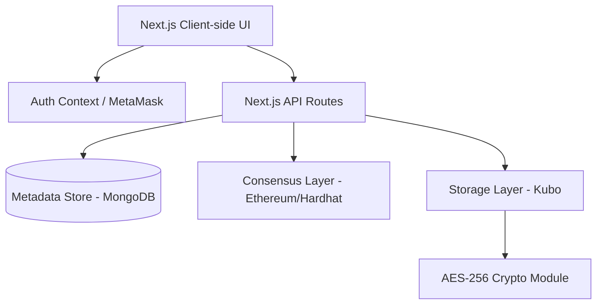
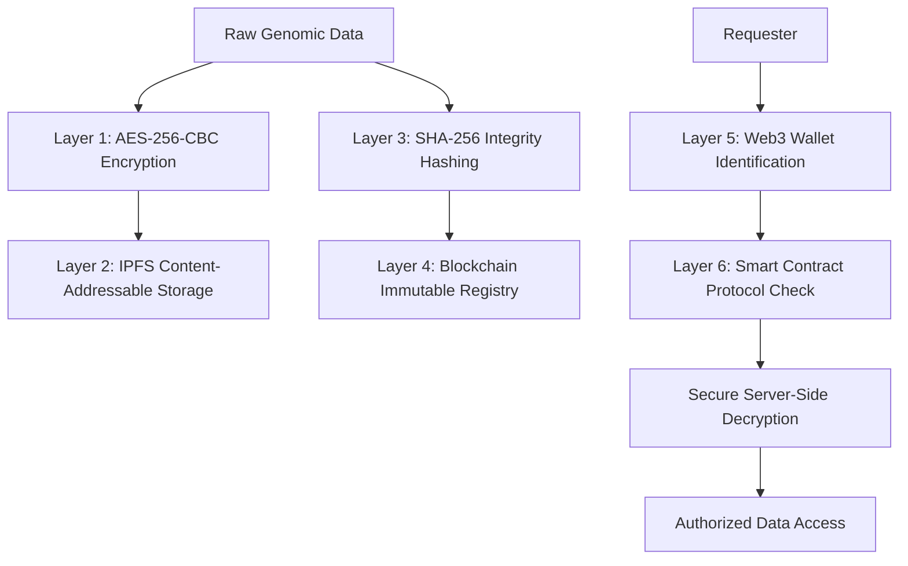
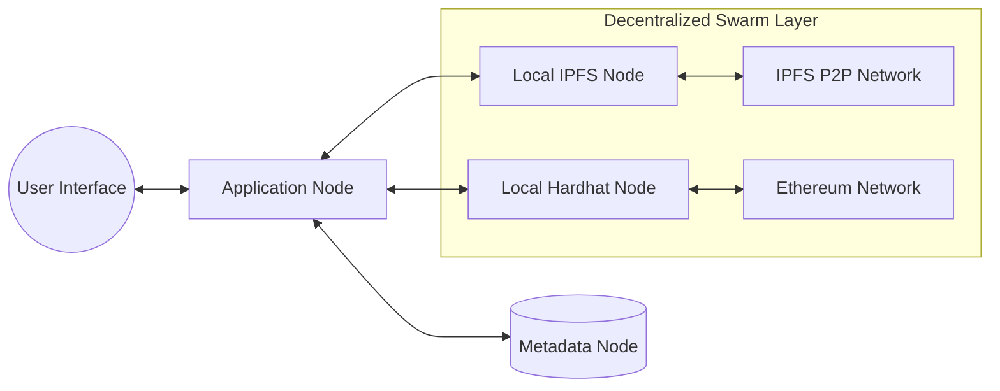
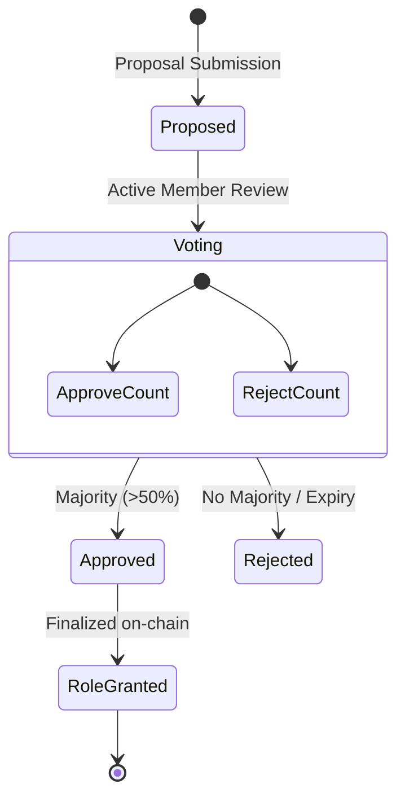

# GenShare: A Decentralized Framework for Secure, Consent-Driven Genomic Data Sharing using Blockchain and IPFS

**Authors:** Aastha Thakker, et al.  
**Keywords:** Blockchain, Genomic Data, IPFS, Smart Contracts, Data Privacy, Decentralized Autonomous Approval (DAA)

---

## Abstract
Sharing genomic data is critical for medical research but faces significant challenges regarding privacy, security, and patient consent. Standard centralized repositories are vulnerable to single-point-of-failure attacks and lack transparent audit trails. This paper proposes **GenShare**, a decentralized hybrid framework that utilizes Ethereum-based smart contracts for consent management and the InterPlanetary File System (IPFS) for immutable, encrypted storage. We introduce a **Decentralized Autonomous Approval (DAA)** mechanism to verify participating organizations and a multi-layered security protocol involving AES-256 encryption and SHA-256 hashing. Our results demonstrate a scalable, zero-knowledge ecosystem where patients maintain sovereignty over their genetic information while researchers access verified, tamper-proof datasets.

---

## 1. Introduction

### 1.1 Background
The rapid advancement of Next-Generation Sequencing (NGS) has led to an explosion of genomic data. This data is invaluable for personalized medicine, oncology, and rare disease research. However, genomic datasets are inherently identifiable and permanent, making their security paramount.

### 1.2 Problem Statement
Current genomic data sharing models rely on centralized "trusted" third parties. This introduces:
1. **Security Risks:** Centralized databases are high-value targets for data breaches.
2. **Lack of Transparency:** Patients often lose track of how and by whom their data is accessed.
3. **Consent Rigidity:** Revoking consent in large-scale databases is often complex or impossible for the average user.

### 1.3 Key Contributions
GenShare addresses these points by:
- Decentralizing storage via IPFS to eliminate single-point-of-failures.
- Using Blockchain to enforce time-bound, revocable consent.
- Implementing an on-chain voting consensus for admitting new Labs and Researchers.

---

## 2. System Architecture

GenShare utilizes a hybrid architectural model that optimizes for the performance requirements of large genomic files and the security requirements of identity and consent.

### 2.1 The Hybrid Model
The architecture separates **State** (Blockchain), **Content** (IPFS), and **Metadata** (MongoDB). This tri-nodal structure ensures that sensitive genomic sequences never exist in plain text outside the lab's local environment or the authorized researcher's decryption tunnel.

---

## 3. Methodology

### 3.1 Data Security & Defense-in-Depth
We implement a six-layer security protocol to ensure data remains confidential, even if individual nodes are compromised.

#### 3.1.1 Layer 1: Cryptographic Protection
Before transmission, files are encrypted using AES-256-CBC. Symmetric keys are managed server-side, ensuring that the IPFS Content ID (CID) alone yields only cipher-text.

#### 3.1.2 Layer 3: Immutable Integrity
Concurrent with encryption, a SHA-256 hash of the original file is computed. This hash is stored on the Ethereum blockchain, serving as a permanent anchor to detect any unauthorized modifications (tamper-evident).

---

## 4. Node Interaction & Data Propagation

GenShare coordinates between local storage nodes and global decentralized swarms.

### 4.1 Data Access Lifecycle
1. **Submission:** Lab uploads NGS data; API encrypts and pins to IPFS.
2. **Registry:** Metadata and hashes are written to the `GenShareRegistry` contract.
3. **Discovery:** Researchers query MongoDB for metadata.
4. **Consent:** Patients authorize Researchers via on-chain `grantConsent()`.
5. **Retrieval:** Researcher requests data; API verifies `isConsentActive()` on blockchain before decrypting storage.

---

## 5. Consensus Mechanisms

### 5.1 Network Level (Protocol Consensus)
The system relies on the underlying Proof of Stake (PoS) consensus of the Ethereum network to ensure the immutability of the ledger.

### 5.2 Application Level (Voting Consensus)
For organizational governance, we introduce a **Decentralized Autonomous Approval (DAA)** system.

This ensures that the "trusted" network of labs is self-governing and resistant to centralized bias.

---

## 6. Security Analysis & Performance

| Threat Vector | Mitigation Strategy | Efficiency |
| :--- | :--- | :--- |
| **Data Tampering** | Blockchain SHA-256 Matching | High (Constant Time) |
| **Unauthorized Access** | Smart Contract Permission Logic | High (O(1) Check) |
| **Sybil Attack** | On-chain Identity Verification | Moderate (Gas Dependent) |
| **Storage Failure** | IPFS Content Replication | High (Decentralized) |

---

## 7. Conclusion
GenShare provides a robust framework for the ethical and secure exchange of genomic data. By merging the speed of NoSQL metadata management with the immutable security of Blockchain and the decentralized storage of IPFS, we create an environment that respects patient sovereignty without impeding medical progress. Future iterations will explore Zero-Knowledge Proofs (ZKP) for privacy-preserving data analysis without full decryption.

---

## References
[1] Nakamoto, S. "Bitcoin: A Peer-to-Peer Electronic Cash System." 2008.  
[2] Benet, J. "IPFS - Content Addressed, Versioned, P2P File System." 2014.  
[3] Buterin, V. "Ethereum: A Next-Generation Smart Contract and Decentralized Application Platform." 2014.
