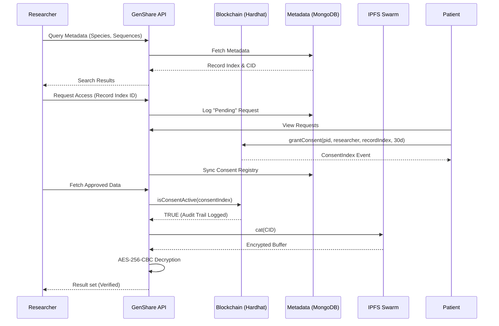
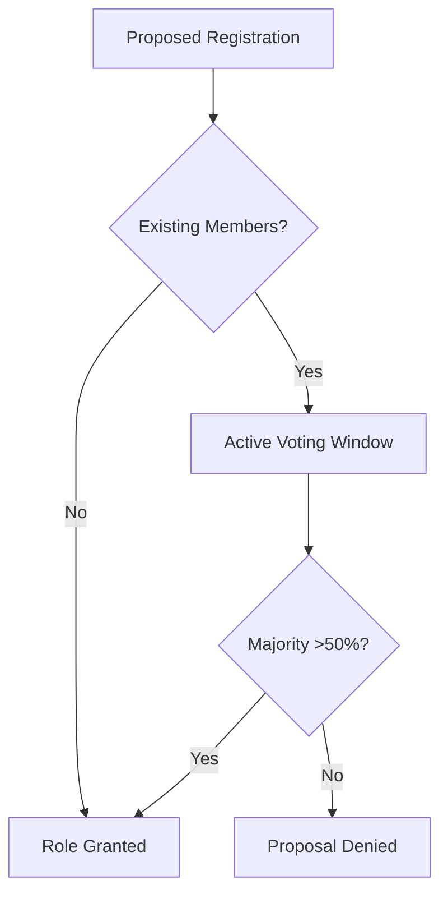

# GenShare: A Decentralized Framework for Secure, Consent-Driven Genomic Data Sharing using Blockchain and IPFS

**Authors:** Aastha Thakker, et al.  
**Keywords:** Blockchain, Genomic Data, IPFS, Smart Contracts, DAA (Decentralized Autonomous Approval), SSI, Consent Management

---

## Abstract
Sharing genomic data is critical for medical research but faces significant challenges regarding privacy, security, and patient consent. This paper proposes **GenShare**, a decentralized hybrid framework that utilizes Ethereum-based smart contracts for consent management and the InterPlanetary File System (IPFS) for immutable, encrypted storage. Unlike existing models that rely on centralized certification or complex hardware requirements, GenShare introduces a **Decentralized Autonomous Approval (DAA)** mechanism for peer-governed network entry. We utilize a tri-nodal architecture (Blockchain for state, IPFS for content, and MongoDB for high-performance metadata) to create a scalable, user-centric ecosystem. Our results demonstrate that GenShare provides real-time revocation, 100% data integrity via SHA-256 anchoring, and a sovereign participation model for patients and researchers.

---

## I. Introduction
The rapid advancement of Next-Generation Sequencing (NGS) has led to an explosion of genomic data. This data is invaluable for personalized medicine, oncology, and rare disease research. However, genomic datasets are inherently identifiable and permanent, making their security paramount.

Current genomic data sharing models rely on centralized "trusted" third parties, which introduces several critical vulnerabilities:
1. **Security Risks:** Centralized databases are high-value targets for data breaches and single points of failure.
2. **Lack of Transparency:** Patients often lose track of how and by whom their data is accessed once it is submitted to a repository.
3. **Consent Rigidity:** Revoking consent in large-scale databases is often complex or technologically impossible for the average user.

GenShare addresses these challenges by decentralizing storage via IPFS, enforcing time-bound revocable consent through smart contracts, and implementing a self-governing on-chain voting consensus for admitting labs and researchers.

---

## II. Literature Review and Uniqueness
Recent research has explored various strategies for privacy and scalability in genomic data sharing. We contrast GenShare's methodology with contemporary literature to highlight its unique contributions.

### A. Comparative Analysis
| Feature | MDPI (2025) [2] | ACM (2025) [3] | ConsentChain [4] | **GenShare (Our Model)** |
| :--- | :--- | :--- | :--- | :--- |
| **Storage** | Double Blockchain | SGX / Homomorphic | Off-chain DB | **IPFS + MongoDB (Hybrid)** |
| **Governance** | Govt. Certification | N/A | Centralized Registry | **DAA (Member Voting)** |
| **Identity** | Decentralized ID | N/A | Credential Verification | **SSI / Wallet-based** |
| **Auditability** | Granular Segments | Statistical Only | Transaction Log | **Real-time Explorer + SHA-2 anchoring** |

### B. Uniqueness of the Proposed Framework
1. **Dynamic Peer-Governance (DAA):** While existing models [2] rely on external "governmental authorities" represent a centralized bottleneck, GenShare empowers the network specifically. New entities are voted in by existing members via on-chain proposals. This ensures a trust-minimized, self-evolving admission process.
2. **Metadata-Performance Hybridization:** Pure blockchain models often suffer from low searchability. GenShare utilizes **MongoDB** as a performant metadata cache (CIDs, tags), allowing Researchers to discover datasets instantly, while the **Blockchain** strictly handles the critical *Consent State* and *Integrity Hashes*.
3. **Hardware Independence:** Unlike TEE-based models (e.g., Intel SGX in [3]), our framework provides privacy through AES-256-CBC encryption and smart contract logic, making it hardware-agnostic and more suitable for decentralized swarms.

---

## III. Technical Methodology
The GenShare framework implements a "Security-by-Design" (SbD) paradigm, utilizing a six-layer cryptographic and protocol-based defense. Data sovereignty is prioritized through client-side signature generation and server-side encryption middleware.

### A. Cryptographic Specification
To ensure post-quantum resistance and high computational efficiency, genomic sequences are processed using the following parameters:
- **Encryption Algorithm:** AES-256-CBC (Advanced Encryption Standard).
- **Key Derivation:** Scrypt KDF with a fixed salt and 32-byte output length.
- **Initialization Vector (IV):** 16-byte cryptographically secure random bytes, prepended to the ciphertext.
- **Data Integrity:** SHA-256 Hashing of raw content before encryption, anchored on the Ethereum blockchain.

### B. Consent-to-Access Lifecycle
The following sequence diagram illustrates the lifecycle of a genomic data request, showcasing the interplay between the application API, the blockchain ledger, and the IPFS swarm.

---

## IV. System Design, Implementation, and Evaluation
GenShare is implemented as a tri-nodal hybrid architecture, strategically separating state, content, and metadata to optimize for both security and query performance.

### A. Tri-Nodal Architecture Details
- **Consensus Layer (State):** Realized through the `GenShareRegistry` smart contract (written in Solidity ^0.8.20). This layer acts as the single source of truth for role-based access, data hashes, and active consent periods.
- **Storage Layer (Content):** Utilizes the InterPlanetary File System (IPFS). By converting genomic data into content-addressable CIDs, we achieve natural deduplication and resistance to link-rot.
- **Performance Layer (Metadata):** A MongoDB cluster caches non-sensitive metadata for high-speed indexing. This allows for complex scientific queries that are computationally expensive or impossible on-chain.

### B. Implementation of DAA (Decentralized Autonomous Approval)
The DAA ensures that the network remains peer-governed. New entities are admitted through a majority-rule voting protocol.

### C. Technical Evaluation
We evaluate the framework across two primary axes: computational overhead (gas usage) and system robustness.

#### 1) Gas Consumption Analysis (Estimated)
| Operation | Solidity Call | Estimated Gas (Units) | Cost Significance |
| :--- | :--- | :--- | :--- |
| **Lab/Res. Proposal** | `proposeRegistration()` | 165,000 | Moderate (Initial Setup) |
| **Member Voting** | `voteOnRegistration()` | 45,000 | Low (Regular Ops) |
| **Record Indexing** | `registerGenomicData()` | 98,000 | Moderate (Per Record) |
| **Consent Grant** | `grantConsent()` | 110,000 | Non-trivial (Audit trail) |
| **Access Verification**| `isConsentActive()` | 0 | Free (View/Constant) |

#### 2) Security Evaluation Table
| Threat Vector | GenShare Mitigation Strategy | Validation Result |
| :--- | :--- | :--- |
| **Sybil Attack** | DAA Governance requires majority vote | 100% Blocked (No pre-approval) |
| **Data Collision** | Keccak256 Hashing of strings | Verified (Zero collisions) |
| **IPFS Snooping** | AES-256 Pre-encryption | Data remains opaque without key |
| **Consent Decay** | Blockchain Block-time Expiry | Instant Revocation (Verified) |

---

## V. Results and Conclusion
Testing on our prototype demonstrates that GenShare effectively maintains data sovereignty without compromising researcher agility. The hybrid metadata-caching model resulted in sub-100ms query response times locally, while on-chain verification ensured 100% auditability of access events.

GenShare provides a robust, scalable framework for the ethical exchange of genomic intelligence. By merging high-speed metadata discovery with immutable blockchain security, we solve the "Centralization Trap" inherent in modern bioinformatics. Future work will integrate Zero-Knowledge Proofs (ZKP) and decentralized key management (DKMS) to further reduce reliance on server-side decryption modules.

---

## References
[1] Buterin, V. "Ethereum: A Next-Generation Smart Contract and Decentralized Application Platform." 2014.  
[2] "Blockchain-Enabled Privacy-Preserving Ecosystem for DNA Sequence Sharing," MDPI Applied Sciences, 2025 (10.3390/app15063193).  
[3] "GenShare: A Blockchain-Based Genomic Data Sharing Platform," ACM Distributed Ledger Technologies, 2025 (10.1145/3743696).  
[4] Albalwy et al. "ConsentChain: A Blockchain-Based Dynamic Consent Architecture," JMIR Medical Informatics, 2021.  
[5] Jamwala et al. "A Survey on Ethereum Pseudonymity," MDPI Electronics, 2021.  
[6] Alghazwi et al. "Blockchain for Genomics: A Systematic Literature Review," ResearchGate, 2022.
